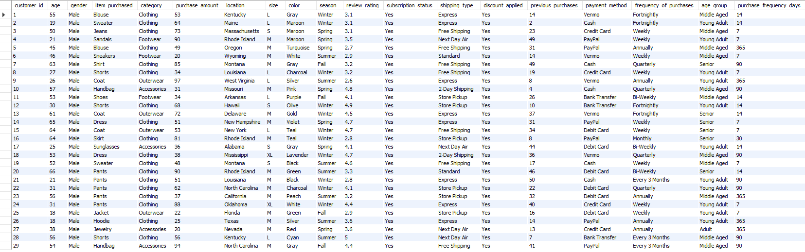
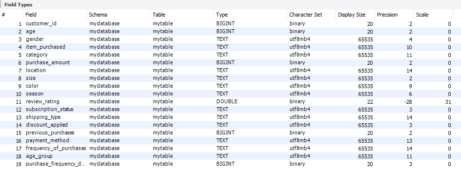
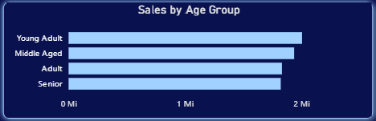
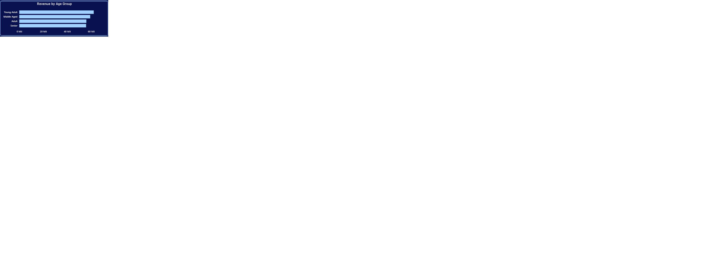
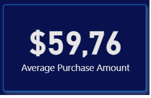
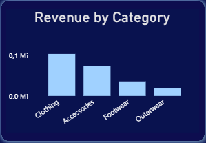
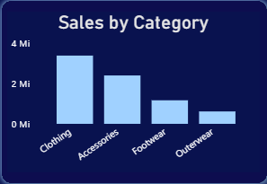

# Project Background

This project analyzes customer shopping behavior for a retail business operating across multiple product categories, including Clothing, Accessories, Footwear, and Outerwear. The company follows a direct-to-consumer model, capturing transactional, demographic, and 
behavioral data such as purchase amount, subscription status, review ratings, discounts, and purchase frequency. From a data analyst’s perspective, the main objective of this analysis was to understand how customer characteristics, purchasing patterns, and subscription 
behavior impact revenue generation and overall customer value. The insights aim to support decisions related to customer segmentation, pricing strategies, promotions, and subscription optimization.

## Insights and recommendations are provided across the following key areas:

- Customer Demographics & Segmentation
- Spending Behavior & Revenue Drivers
- Subscription & Loyalty Analysis
- Product & Category Performance

The Python code used to inspect and clean the data for this analysis can be found here: [[/Customer_Data_Cleaning.py](https://github.com/DaviGusstschenko/Data_Analysis_Customer_Behavior/blob/main/Customer_Data_Cleaning.py)

Targeted SQL queries addressing specific business questions can be found here: [[Data_analysis_SQL.sql](https://github.com/DaviGusstschenko/Data_Analysis_Customer_Behavior/blob/main/Data_analysis_SQL.sql)].

An interactive Power BI dashboard used to explore customer behavior and sales trends can be found here: [[Customer_Behavior_DashBoard.pbix]([https://github.com/DaviGusstschenko/Data_Analysis_Customer_Behavior/blob/main/Customer_Behavior_DashBoard.pbix)]. (You'll have to download it)

## Data Structure & Initial Checks

The company’s main database consists of a single consolidated table created after data cleaning and preparation, containing approximately 3.9K customer records.
Key fields include:

Customer demographics: age, gender, age group
Transactional data: purchase amount, item purchased, category, shipping type
Behavioral data: previous purchases, purchase frequency, subscription status
Promotional data: discount applied
Customer feedback: review rating

 

During the preparation phase, missing review ratings were imputed using the median rating per category, column names were standardized, categorical purchase frequencies were converted into numeric values (days), and redundant promotional variables were removed to avoid duplicated information.

## Executive Summary

### Overview of Findings

The analysis shows that customer spending is strongly influenced by product category, age group, and subscription status. Clothing consistently drives the highest revenue, while younger and middle-aged customers represent the most valuable segments. Subscription status 
is associated with higher overall revenue contribution, suggesting loyalty-driven value creation. If a stakeholder were to take away three main insights from this project, they should know:

- A small set of product categories drives the majority of revenue.
- Customer age and purchasing history are strong indicators of lifetime value.
- Subscribed and repeat customers contribute disproportionately to total revenue.

The full dashboard for you to look: [[Customer_Behavior_Dashboard.png](https://github.com/DaviGusstschenko/Data_Analysis_Costumer_Behavior/blob/main/Customer_Behavior_Dashboard.png)]

## Insights Deep Dive

### Category 1: Customer Demographics & Segmentation

- Main Insight 1:
Young Adult and Middle-Aged customers generate the highest total revenue, outperforming both Adult and Senior groups.
- Main Insight 2:
Repeat and loyal customers (more than two previous purchases) form a significant portion of the customer base, indicating strong retention potential.
- Main Insight 3:
Gender-based revenue differences exist, with one gender contributing slightly more to total revenue, suggesting opportunities for targeted marketing.
- Main Insight 4:
Customers with higher previous purchase counts are more likely to engage with subscriptions.

 

### Category 2: Spending Behavior & Revenue Drivers

- Main Insight 1:
The average purchase amount is approximately $59.76, serving as a useful benchmark for identifying high-value transactions.
- Main Insight 2:
Customers who use discounts but still spend above the average purchase amount represent a high-value promotional segment.
- Main Insight 3:
Express shipping users show slightly higher average purchase amounts compared to standard shipping customers.
- Main Insight 4:
Purchase frequency, when converted into numeric days, reveals that more frequent buyers tend to generate higher cumulative revenue.

 

### Category 3: Product & Category Performance

- Main Insight 1:
Clothing is the top-performing category in both total sales and revenue.
- Main Insight 2:
Accessories and Footwear show moderate performance, while Outerwear contributes the least.
- Main Insight 3:
Certain products consistently rank among the highest in average review ratings, indicating quality-driven demand.
- Main Insight 4:
Products with higher discount application rates still maintain strong sales volumes, suggesting effective promotional strategies.

## Recommendations

Based on the insights above, the business should consider the following actions:

- Focus marketing efforts on Young Adult and Middle-Aged segments, as they generate the highest revenue.
- Expand subscription incentives for repeat buyers to maximize lifetime value.
- Leverage high-performing product categories, particularly Clothing, when launching promotions.
- Use discounts strategically, targeting customers who already exhibit higher-than-average spending behavior.
- Invest in top-rated products, as customer satisfaction aligns strongly with sales performance.
